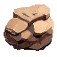

# pixel art creator
Преобразует исходное изображение в pixel art с использованием заданной палитры
- Краткий алгоритм:
    - берется изображение input_img
    - разбивается на блоки по pixel_size
    - в каждом блоке находится преобладающий цвет
    - преобладающий цвет сопоставляется с палитрой input_palette
    - на весь блок ставится выбранный цвет палитры
    - полученное изображение маштабируется под размер output_size на output_size

## Установка
- поставить python (https://www.python.org/)
- выполнить клонирование кода и установку зависимостей
```bash
git clone https://github.com/neriper/pixel_art_creator.git
cd pixel_art_creator
py -m venv .venv
.venv\Scripts\pip install -r requirements.txt
```

## Использование
Пример:  - изображение 64х64 НЕ совпадающее по цветам с test_palette.png:
прогон тестового примера, конвертирует картинку под test_palette.png и уменьшает разрешение до 32х32

- Запуск из терминала:
  - python - путь до python
  - pixel_art_creator.py - скрипт скаченный из репозитория
  - test_data/test_image.png - исходное изображение
  - test_data/test_palette.png - палитра, полоска высотой в 1 пиксель и произвольной длиной, где каждый пиксель уникальный цвет (см пример палитры в [test_data](test_data))
  - 1 - количество пикселей представляющее один условный блок обработки в исходном изображении
  - 32 - размер изображения-результата 32х32 пикселей
```shell
python pixel_art_creator.py test_data/test_image.png test_data/test_palette.png 1 32
```
- запуск из кода:
  - открыть файл [pixel_art_creator.py](pixel_art_creator.py)
  - выполнить функцию: create_pixel_art
    - значения параметров описаны в функции